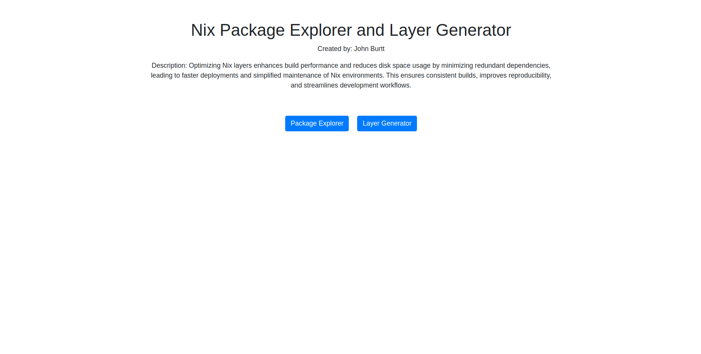

# Nix_Store_File_Browser

## Description
The goal with the Nix Package Explorer and Layer Generator is twofold, with the first being to provide an intuitive way to explore the packages that compose a project. This is accomplished by being able to generate lists of packages with the `Package Explorer` tool that provide meaningful metrics such as entropy and dependency weight as well as by allowing the client to specify sort and filter critera based on those same metrics. From there, the client can take this newfound deeper understanding of their project to the `Layer Generator` to create optimized Nix Layers for their containers.

## Motivation
Optimizing Nix layers enhances build performance and reduces disk space usage by minimizing redundant dependencies, leading to faster deployments and simplified maintenance of Nix environments. This mjkensures consistent builds, improves reproducibility, and streamlines development workflows.

## Visuals

## Installation
Within a particular ecosystem, there may be a common way of installing things, such as using Yarn, NuGet, or Homebrew. However, consider the possibility that whoever is reading your README is a novice and would like more guidance. Listing specific steps helps remove ambiguity and gets people to using your project as quickly as possible. If it only runs in a specific context like a particular programming language version or operating system or has dependencies that have to be installed manually, also add a Requirements subsection.

## Usage
Use examples liberally, and show the expected output if you can. It's helpful to have inline the smallest example of usage that you can demonstrate, while providing links to more sophisticated examples if they are too long to reasonably include in the README.

## Support
Tell people where they can go to for help. It can be any combination of an issue tracker, a chat room, an email address, etc.

## Roadmap

<!-- # Git ls-remote data instead of hydra data
Like how the entropy for the `Layer Generator` tool is now calculated with the references from the remote repository instead of through Hydra, ` -->

### Replacing Flask
While Flask is simplistic, flexible and minimalistic, if this project were to be built upon any further, a more robust framework should be used in place of it such as Django, which offers a comprehensive set of built-in features, including an ORM, authentication system, and admin interface

### More Sophisticated Entropy Calculation
Because of how the git ls-remote entropy calculation is currently done which is by keeping track of all of the store paths for a given package and then returning this count, how often package x changes when package y changes is not calculated like how it is in the Hydra API based on entropy calculation which is useful for creating groups of packages to be used for layers.

### Simulating Development Cycle to Test Build Efficiency
There should be the ability to simulate the generated layers over a development cycle to test how much build storage it requires so that the client can adjust the configurations accordingly. Better yet, it should automatically optimize the entropy calculation start and end dates as well as the minimum and maximum layer size such that it requires as little build storage as possible (and does not exceed a layer count limited specified by the client?).

## Contributing
State if you are open to contributions and what your requirements are for accepting them.

For people who want to make changes to your project, it's helpful to have some documentation on how to get started. Perhaps there is a script that they should run or some environment variables that they need to set. Make these steps explicit. These instructions could also be useful to your future self.

You can also document commands to lint the code or run tests. These steps help to ensure high code quality and reduce the likelihood that the changes inadvertently break something. Having instructions for running tests is especially helpful if it requires external setup, such as starting a Selenium server for testing in a browser.

## Authors

John Burtt

## Acknowledgments

Special thanks to Mike Purvis, Anil Kapu, Ivor Wanders, and Ferenc Koncz for their valuable contributions and support throughout the development process.

## License
For open source projects, say how it is licensed.

## Project status
If you have run out of energy or time for your project, put a note at the top of the README saying that development has slowed down or stopped completely. Someone may choose to fork your project or volunteer to step in as a maintainer or owner, allowing your project to keep going. You can also make an explicit request for maintainers.

## Project File Structure 
Nix_Store_File_Browser/
│
├── app/
│   ├── __init__.py            # Initializes the Flask app
│   ├── routes.py              # Contains Flask routes
│   ├── socketio_handlers.py   # Contains SocketIO handlers
│   ├── models.py              # Contains database models (if using a database)
│   ├── templates/             # Contains HTML templates
│   │   ├── index.html         # Example HTML template
│   │   └── ...
│   ├── static/                # Contains static files (CSS, JavaScript, images)
│   │   ├── style.css          # Example CSS file
│   │   └── ...
│   └── other_module.py        # Other modules if needed
│
│
├── config.py                   # Configuration settings
├── requirements.txt            # List of Python dependencies
└── run.py                      # Main entry point of your Flask application